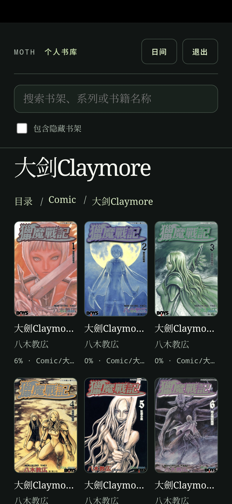
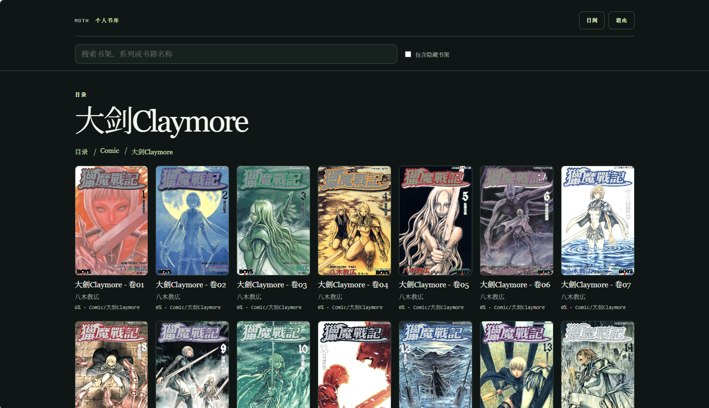

<p align="center">
  
</p>

<h1 align="center">Moth</h1>

<p align="center">书放在文件夹里，Moth 负责打开它。</p>

Moth 是一个单用户、filesystem-first、自托管的 PWA 阅读器。它直接读取你的书库目录，支持 EPUB、TXT、CBZ 和经典无 DRM MOBI；原文件保持不动，服务器只在数据目录维护索引、派生缓存和阅读进度。

它的定位很简单：**Moth 是 Filesystem Reader，不是 Library Server。** 书籍管理、元数据维护和文件整理留在文件系统中，Moth 专注于打开和阅读。

Moth 不提供独立的 Android、iOS 或桌面客户端。手机端建议用浏览器打开后选择“添加到主屏幕”或“安装应用”，以 PWA 模式使用；桌面端直接使用浏览器访问即可。单用户的阅读进度会永久保存在自托管数据目录中的 SQLite 数据库，并通过登录会话在设备之间同步。

| 单用户 | 自托管 | PWA | 只读书库 |
| --- | --- | --- | --- |
| 一个账户 | Docker 或本地运行 | 手机与桌面 | 不改动原文件 |

## 截图

<table>
  <tr>
    <td align="center" valign="top">
      
    </td>
    <td align="center" valign="top">
      
    </td>
  </tr>
</table>

## 为什么是 Moth

- **文件系统就是配置。** `MOTH_BOOKS_DIR` 是唯一书库根目录，子目录自然形成分类、书架和系列。
- **不刮削、不接管。** 不抓取作者、标签或在线封面，不改名、不复制、不移动你的书。
- **打开即读。** EPUB 使用 HTTP Range 和 CFI，TXT 支持编码检测、中文章节索引和精确字符定位，CBZ 支持单页、双页、连续滚动和 LTR/RTL，MOBI 首次打开时转换为 EPUB 缓存。
- **阅读体验保持统一。** 主页、目录、书架和系列页支持全书库名称搜索；桌面支持键盘翻页和自动双页，阅读完成后可顺序进入同系列下一本；手机 PWA 使用全屏和安全区适配。
- **进度跨设备保存。** 阅读进度永久保存在自托管服务器的数据目录中，并在登录设备之间同步；阅读设置保存在浏览器 `localStorage`。
- **保持轻量。** 当前参考测量如下，实际数值会随平台、书库规模和阅读格式变化：

  | 项目 | 参考值 |
  | --- | ---: |
  | Docker 镜像 | < 30 MB |
  | 解包后的运行时 | < 150 MB |
  | 空闲内存 | ≈ 5 MB |
  | 阅读中内存 | ≈ 50 MB |

  参考口径：amd64/Linux Docker 环境，使用 `docker stats` 观察运行中的服务。

## 书库目录

Moth 要求书籍按“一级书架 / 二级系列 / 书籍文件”的格式收纳。书籍文件直接放在二级系列目录中，不要直接放在书架目录下，也不要在系列目录中继续嵌套目录：

~~~
books/
├── 小说/              # 一级书架
│   ├── 三体/           # 二级系列
│   │   ├── 01.epub    # 书籍文件
│   │   └── 02.epub
│   └── 基地/           # 二级系列
│       └── 01.txt
└── 漫画/              # 一级书架
    └── 漩涡/           # 二级系列
        └── 01.cbz
~~~

要把一级书架从首页收进“更多书架”，在该书架下放一个名为 `hide` 的普通文件：

~~~
books/漫画/hide
~~~

只检查一级书架；根目录或系列目录中的同名文件不会生效。"更多书架"仍可从完整目录访问，也可以在搜索时选择“包含隐藏书架”。

## Docker Compose

准备一个数据目录和一个书库目录：

~~~
mkdir -p data books
~~~

推荐使用 docker compose 安装
```yaml
services:
  moth:
    image: ghcr.io/pzweuj/moth:latest
    user: "0:0"
    ports:
      - "8080:8080"
    volumes:
      - ./data:/data
      - ./books}:/books:ro         # 或者绑定你已经结构化好的目录
    healthcheck:
      test:
        - CMD-SHELL
        - curl --fail --silent --show-error http://127.0.0.1:8080/api/v1/health || exit 1
      interval: 30s
      timeout: 5s
      start_period: 10s
      retries: 3
    restart: unless-stopped
```

然后打开 <http://localhost:8080/setup> 创建单用户账户。Compose 默认使用 `ghcr.io/pzweuj/moth:latest`，并将：

- `./data` 挂载到 `/data`，保存 SQLite、封面和派生缓存；
- `${MOTH_BOOKS_PATH:-./books}` 以只读方式挂载到 `/books`。

## 明确不做

以下功能超出 Moth 的产品边界：离线书籍、多用户、上传、OPDS、Kobo/KOReader、在线书源、元数据抓取、作者或标签管理、文件整理、推荐、AZW3/KF8、PDF 和 FB2。

Moth 的产品边界以 [`CORE.md`](CORE.md) 为准。功能请求首先需要符合这份核心定义，而不是把 Moth 变成另一个媒体库管理器。
